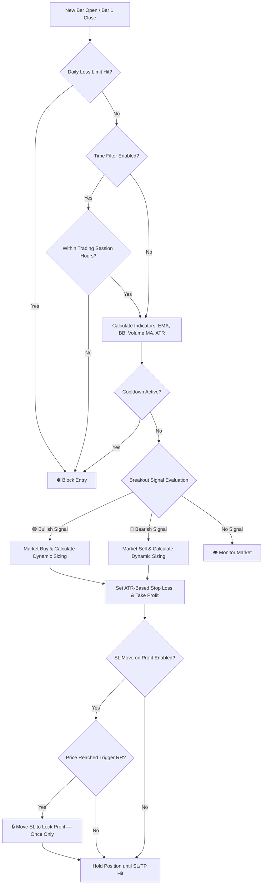
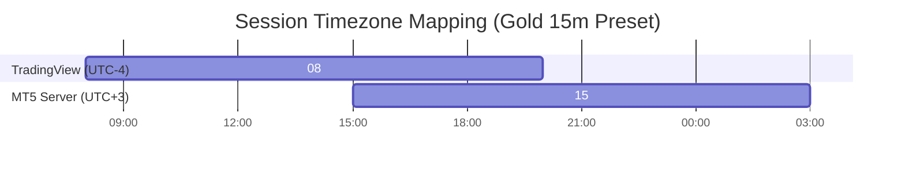

# 📈 Breakout Follow Trend 101

<div align="center">


<br/>

**An Institutional-Grade, Quantitative Trend-Following Framework Optimized for Gold (XAUUSD)**

*Capturing volatility expansion via Bollinger Band breakouts, filtered by multi-layer EMA trend checks and volume momentum — featuring 100% verified logic parity between TradingView and MetaTrader 5.*

</div>

---

> [!NOTE]
> 🏆 **Prop Firm Evaluation Ready**: Engineered with high-precision risk controls and strict daily drawdown safeguards to reliably pass Prop Firm challenges.

> [!IMPORTANT]
> ⚡ **100% Zero-Drift Logic Parity**: Mathematical alignment across TradingView (Visualization/Backtest) and MetaTrader 5 (Live Execution). Indicators, entry triggers, stop-loss calculations, and risk modules match 1:1.

---

## 📌 Table of Contents

- [📂 Repository Blueprint](#-repository-blueprint)
- [🚀 Quick Start Guide](#-quick-start-guide)
- [📐 Core Logic & Strategy Rules](#-core-logic--strategy-rules)
  - [Technical Indicators](#technical-indicators--settings)
  - [Entry Signals (LONG / SHORT)](#-long-buy-entry-conditions)
- [🔄 Dual-Platform Execution Lifecycles](#-dual-platform-execution-lifecycles)
- [🛡️ Advanced Risk Management](#-advanced-risk-management--capital-preservation)
- [🕒 Timezone Mapping & Synchronization](#-timezone-mapping--synchronization)
- [🤝 System Parity & Math Alignment](#-system-parity--math-alignment)
- [🖼️ Visual Chart Tools (TradingView)](#-visual-chart-tools-tradingview-only)
- [🏆 High Win-Rate Preset Parameters (15m)](#-high-win-rate-preset-parameters-15m)
- [💖 Support this Project](#-support-this-project)

---

## 📂 Repository Blueprint

```text
breakout-follow-101/
├── .agents/                 # AI Assistant skills, rules, and workspace configurations
├── img/                     # Image assets & visuals (e.g. donation QR code)
├── src/
│   ├── mql5/                # MetaTrader 5 Expert Advisor (BreakoutFollowTrend.mq5)
│   └── pine/                # TradingView Pine Script v5 (BreakoutFollowTrend_Strategy.pine)
└── README.md                # Technical System Specification (This Document)
```

---

## 🚀 Quick Start Guide

### 1️⃣ MetaTrader 5 Expert Advisor (Automated Execution)
1. Copy [`src/mql5/BreakoutFollowTrend.mq5`](src/mql5/BreakoutFollowTrend.mq5) to your MT5 terminal directory: `/MQL5/Experts/`.
2. Open **MetaEditor** (`F4`), compile the file (`F7`), and attach the Expert Advisor to a **Gold (XAUUSD)** **15m** chart.
3. Enable **Algo Trading** in your MT5 toolbar and configure risk inputs.

### 2️⃣ TradingView Pine Script (Strategy Tester & Visual Overlay)
1. Open [`src/pine/BreakoutFollowTrend_Strategy.pine`](src/pine/BreakoutFollowTrend_Strategy.pine) and copy the entire source code.
2. In TradingView, open the **Pine Editor** tab at the bottom, paste the code, and click **Save**.
3. Click **Add to Chart** and launch the **Strategy Tester** panel to evaluate performance metrics.

---

## 📐 Core Logic & Strategy Rules

The strategy isolates high-probability breakout trades during expanding volatility sessions while neutralizing emotional bias.



---

### Technical Indicators & Settings

| Indicator | Default Setting | Technical Purpose |
| :--- | :--- | :--- |
| **EMA Filter** | `Period = 200` | Primary trend filter direction lock |
| **EMA Body Overlap Filter** | `Enabled` (`true`) | Blocks trades when signal bar range straddles the EMA line |
| **Bollinger Bands** | `Period = 15`, `StdDev = 1.5` | Volatility expansion & breakout trigger |
| **Volume MA** | `Period = 15` (SMA) | Volume momentum filter |
| **ATR** | `Period = 18` (Wilder's RMA) | Volatility-adjusted SL/TP baseline |

---

### 🟢 LONG (Buy Entry) Conditions
Confirmed strictly on **Bar 1 Close** (completed bar):
- 📈 **Trend Filter**: `Close > EMA 200`
- 🛡️ **EMA Body Filter**: `Low > EMA 200` (Candle low remains above EMA)
- 🚀 **BB Breakout**: `Close > Upper BB`
- 📊 **Volume Momentum**: `Volume > Vol SMA 15`
- ⚡ *Execution: Market BUY executed at the open of Bar 0.*

### 🔴 SHORT (Sell Entry) Conditions
Confirmed strictly on **Bar 1 Close** (completed bar):
- 📉 **Trend Filter**: `Close < EMA 200`
- 🛡️ **EMA Body Filter**: `High < EMA 200` (Candle high remains below EMA)
- 🔻 **BB Breakout**: `Close < Lower BB`
- 📊 **Volume Momentum**: `Volume > Vol SMA 15`
- ⚡ *Execution: Market SELL executed at the open of Bar 0.*

---

## 🔄 Dual-Platform Execution Lifecycles

To ensure **100% logic alignment**, both platforms handle price processing identically:

```text
[Bar 2: Completed] ----> [Bar 1: Signal Candle Closes] ----> [Bar 0: Entry Bar Opens]
                               │                                     │
                               ├── Indicator evaluation              └── Market Order Execution
                               └── Setup SL/TP values                     SL/TP Attached instantly
```

* **TradingView Engine**: Evaluates signal conditions at the close of **Bar 1**, simulating execution at the open price of **Bar 0**.
* **MT5 EA Event Loop**: Uses `OnTick()` to detect a new bar event. Once Bar 0 begins, it queries indicator values corresponding to **Bar 1** timestamp (`bar1_time`) and places the market order immediately.

---

## 🛡️ Advanced Risk Management & Capital Preservation

Institutional protection mechanisms engineered directly into MQL5 and Pine Script:

### 1. 💰 Dynamic Volatility Position Sizing
* **Compounding Mode**: Position size auto-scales dynamically based on current equity and ATR Stop Loss distance.
* **Fixed Balance Mode**: Uses a static reference balance (`Fixed Balance = 10,000`) for fixed-lot risk profiles.
* **Tick Precision**: Automatically rounds Stop Loss and Take Profit levels to standard symbol tick increments to avoid order rejection.

### 2. ⛔ Transactional Daily Loss Limit (Drawdown Lockout)
* Real-time monitoring of realized Daily P&L.
* Suspends trading immediately if total daily loss reaches **1.0%** (default) of the day's starting equity.
* Resets automatically at server midnight (`00:00`).

### 3. 🗓️ Weekend Liquidation Policy
* Eliminates broker weekend gap risk by force-closing open trades on Friday at **23:45** (default).
* Halts new entries until Monday market open.

### 4. 🔒 SL Move on Profit (Breakeven+ Protection)
* **Trigger Threshold**: Activates when trade reaches `0.2 RR` (default).
* **SL Adjustment**: Repositions SL into profit: $\text{Entry} \pm (\text{TP Distance} \times 12\%)$.
* **One-Shot Safety**: Executes once per order lifetime and only improves existing SL.

### 5. ⏳ Cooldown Period After Exit
* Prevents over-trading by blocking entries for **9 bars** (2 hrs 15 mins on 15m) after any trade closure (SL/TP/Weekend close).

---

## 🕒 Timezone Mapping & Synchronization

Pine Script processes sessions in **Exchange Time (UTC-4 / New York)**, while MT5 operates on **Broker Server Time**.



### 📐 Conversion Formula
$$\text{MT5 Hour} = \text{TradingView Exchange Hour} + (\text{MT5 Broker UTC Offset} - (-4))$$

### 🌐 Universal Conversion Matrix (Gold 15m Preset)

| Broker Server Timezone | Trading Session (Start - End) | Note |
| :--- | :--- | :--- |
| **UTC + 0** (GMT Broker) | **12:00 – 24:00** | Standard Session |
| **UTC + 2** (EET Winter) | **14:00 – 02:00** | Crosses Midnight |
| **UTC + 3** (EEST Summer / Cyprus) | **15:00 – 03:00** | Standard MT5 Broker Offset |
| **UTC + 5** (Central Asian) | **17:00 – 05:00** | Crosses Midnight |

---

## 🤝 System Parity & Math Alignment

Mathematical safeguards preventing divergence between backtesting and live trading:

- 🎯 **Tick Rounding**: Standardized SL/TP calculations rounded to exact symbol tick size.
- 🕒 **Bar-1 Signal Lock**: Session window limits are calculated using Bar 1 open time.
- 🔄 **Async Buffer Sync**: MT5 queries indicator data using explicit datetime timestamps (`bar1_time`) to prevent signal lag.
- 📐 **Wilder's Smoothing**: Identical RMA formula used for ATR across both environments.
- 📋 **Order Queue Management**: FIFO mapping queue keeps multi-trade entries cleanly tracked with individual ATR targets.

---

## 🖼️ Visual Chart Tools (TradingView Only)

The Pine Script engine renders real-time execution visuals directly on your chart:

| Chart Element | Color Code | Visual Indicator Function |
| :--- | :--- | :--- |
| **Take Profit Zone** | 🟢 Green `#089981` | Dynamic Take Profit Target Box |
| **Stop Loss Zone** | 🔴 Red `#f23645` | Standard Risk Zone |
| **Protected SL** | 🟡 Amber `#d4a017` | Activated when *SL Move on Profit* triggers (`SL★`) |
| **Entry Price Line** | ⬜ Gray `#b2b5be` | Dashed horizontal line at actual fill price |

---

## 🏆 High Win-Rate Preset Parameters (15m)

Optimized settings tuned specifically for **Gold (XAUUSD) 15m**:

| Category | Input Parameter | Preset Value | Purpose / Description |
| :--- | :--- | :--- | :--- |
| **Risk Management** | Risk % per Trade | **1.6%** | Optimized account exposure |
| | Risk:Reward Ratio | **2.2** | High expectancy TP target |
| | ATR Multiplier (SL) | **2.0** | Volatility-adjusted stop range |
| | Max Concurrent Trades | **1** | Single position discipline |
| | Compounding Risk | **Disabled** (`false`) | Constant lot calculation mode |
| | Fixed Balance | **10,000** | Reference balance for fixed sizing |
| | Daily Loss Limit % | **1.0%** | Hard daily drawdown limit |
| **SL Move on Profit** | Enable SL Move | **Enabled** (`true`) | Breakeven+ protection toggle |
| | Trigger at RR | **0.2** | Activation profit distance |
| | New SL % of TP | **1%** | Profit locked into SL |
| **Indicators** | EMA Filter | **Enabled** (`true`) | 200 EMA trend filter |
| | EMA Body Overlap | **Enabled** (`true`) | Straddle entry block |
| | EMA Period | **200** | Long-term trend baseline |
| | BB Period / Dev | **15 / 1.5** | Volatility breakout bounds |
| | ATR Period | **18** | Wilder's RMA length |
| **Volume Filter** | Enable Volume Filter | **Enabled** (`true`) | Momentum confirmation |
| | Volume MA Period | **15** | SMA volume baseline |
| **Session Timing** | Enable Time Filter | **Enabled** (`true`) | Disable = trade all day, no hourly restriction |
| | Start / End Hour | **8 / 20** | Exchange session window (active when Time Filter on) |
| | Weekend Close | **Enabled** (`true`) | Friday risk liquidation |
| | Friday Close Time | **2345** | Weekly exit cut-off time |
| **Cooldown** | Enable Cooldown | **Enabled** (`true`) | Over-trading guard |
| | Cooldown Bars | **9** | Delay period after exit (2h 15m) |

---

## 💖 Support this Project

If this system brings value to your trading, feel free to support future development! ☕

<div align="center">

```text
USDC (ERC20): 0x104FA6E83F2322bdFbf1501a6d9959A0a76bc1D7
```

<br/>


<br/>

</div>
