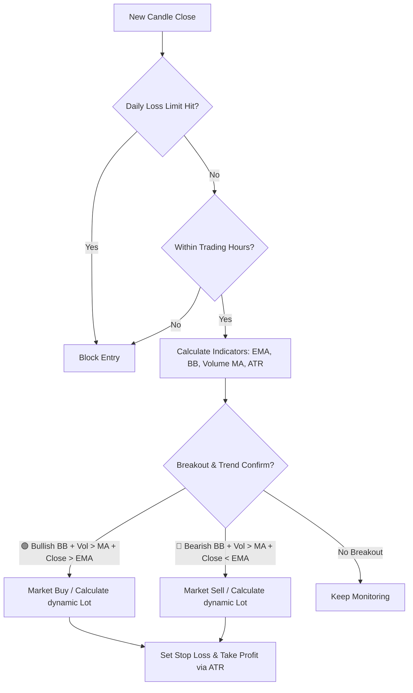

```mermaid
gantt
    title Timezone Mapping (Gold 15m Preset)
    dateFormat HH
    axisFormat %H:00
    section TradingView (Exchange Time / UTC-4)
    Trading Session (13:00 - 20:00) :active, 13, 20
    section MT5 Broker Server Time (UTC+3)
    Trading Session (20:00 - 03:00) :crit, 20, 27
```

# 📈 Breakout Follow Trend 101

[](https://github.com/jzd101/breakout-follow-101)
[](https://github.com/jzd101/breakout-follow-101)
[](https://github.com/jzd101/breakout-follow-101)
[](https://github.com/jzd101/breakout-follow-101)
[](https://github.com/jzd101/breakout-follow-101)
[](https://github.com/jzd101/breakout-follow-101)

An automated, quantitative volatility breakout trading system specifically optimized for **Gold (XAUUSD)**. This system trades volatility expansions (Bollinger Band breakouts) confirmed by trend direction filters (EMA) and volume momentum (Volume MA), utilizing 100% aligned logic across TradingView visualization and MetaTrader 5 execution.

> [!NOTE]
> **Prop Firm Verification**: This strategy has been proven to successfully pass Prop Firm evaluation challenges.

> [!IMPORTANT]
> **100% Logic Parity Guarantee**: This repository maintains absolute mathematical alignment across TradingView (Visualization) and MetaTrader 5 (Execution). Every entry, exit, indicator, and risk calculation matches perfectly across both platforms to eliminate strategy drift.

---

## 📂 Repository Blueprint

```text
breakout-follow-101/
├── .agents/                 # AI Assistant skills and settings
├── src/
│   ├── mql5/                # MetaTrader 5 Expert Advisor (BreakoutFollowTrend.mq5)
│   └── pine/                # TradingView Pine Script v5 (BreakoutFollowTrend_Strategy.pine)
└── README.md                # Comprehensive System Technical Specification (This File)
```

---

## 🚀 1-Minute Quick Start

### 1. MetaTrader 5 Expert Advisor
Deploy for automated real-time execution:
1. Copy [BreakoutFollowTrend.mq5](src/mql5/BreakoutFollowTrend.mq5) to your terminal's `/MQL5/Experts/` folder.
2. Compile the EA inside MetaEditor and attach it to a **Gold (XAUUSD)** chart on the **1H** or **15m** timeframe.
3. Enable **Algo Trading** in your MT5 terminal.

### 2. TradingView Pine Script
Visualize entry signals and dynamic risk tools:
1. Copy the full source code from [BreakoutFollowTrend_Strategy.pine](src/pine/BreakoutFollowTrend_Strategy.pine).
2. In TradingView, open the **Pine Editor** tab, paste the code, and click **Save**.
3. Click **Add to Chart** and open the **Strategy Tester** tab to inspect trade histories.

---

## 📐 Core Logic & Strategy Rules

The Breakout Follow Trend system relies on pure statistics and momentum confirmation, removing emotional variables from execution.



### Technical Indicators & Settings
| Indicator | Default Setting | Purpose |
| :--- | :--- | :--- |
| **EMA** | Period = 200 | Primary Trend Filter |
| **Bollinger Bands** | Period = 15, StdDev = 1.5 | Breakout Trigger |
| **Volume MA** | Period = 15 (SMA) | Momentum Filter |
| **ATR** | Period = 14 | Dynamic SL/TP Base (Wilder's RMA Smoothing) |

---

### 🟢 LONG (Buy Entry) Conditions
All conditions must be confirmed on the **Close of Candle 1** (completed candle):
*   **Trend Filter**: Price is strictly above EMA 200 (`Close > EMA 200`).
*   **BB Breakout**: Candle close is greater than the Upper Bollinger Band (`Close > Upper BB`).
*   **Volume Momentum**: Volume is greater than the 15-period Volume MA (`Volume > Vol SMA 15`).
*   *Execution: Market BUY order opened at the open of the very next candle (Candle 0).*

### 🔴 SHORT (Sell Entry) Conditions
All conditions must be confirmed on the **Close of Candle 1** (completed candle):
*   **Trend Filter**: Price is strictly below EMA 200 (`Close < EMA 200`).
*   **BB Breakout**: Candle close is less than the Lower Bollinger Band (`Close < Lower BB`).
*   **Volume Momentum**: Volume is greater than the 15-period Volume MA (`Volume > Vol SMA 15`).
*   *Execution: Market SELL order opened at the open of the very next candle (Candle 0).*

---

## 🔄 Dual-Platform Execution Lifecycles

Understanding how TradingView and MetaTrader 5 process price data is crucial for achieving 100% execution parity.

*   **TradingView's Historical vs. Real-time Execution**: In TradingView, backtesting calculations run once per candle close. When a candle closes (Bar 1), indicators are evaluated. If a breakout occurs, Pine Script's execution engine simulates the entry at the opening tick of the next bar (Bar 0).
*   **MT5 Expert Advisor Real-time Execution**: The MT5 Expert Advisor operates within the `OnTick()` event loop. To avoid entering trades mid-candle (which creates historical divergence), the EA monitors when a new bar has just opened. Once detected, it immediately queries indicator buffers for the completed candle (Bar 1) to evaluate trade signals and execute instantly on Bar 0.

---

## 🛡️ Advanced Risk & Capital Preservation Controls

The Breakout Follow Trend system incorporates active institutional-grade capital preservation safeguards, fully integrated and logically aligned across MQL5 and Pine Script.

### 1. Dynamic Volatility-Based Position Sizing
When **Compounding Risk** is enabled, the trade lot size is dynamically computed based on the active account equity and the volatility-based Stop Loss distance (ATR multiplied by the ATR Multiplier).
*   **Compounding Enabled**: Lot sizes scale up as the account grows and shrink during drawdowns.
*   **Compounding Disabled**: Sizing is calculated using a user-defined Fixed Balance, maintaining consistent lot sizes regardless of live equity.
*   **Tick Rounding**: Both platforms round the Stop Loss and Take Profit distances to the nearest tick value before executing, preventing order rejection on MT5 due to raw decimal price offsets.

### 2. Transactional Daily Loss Limit (Drawdown Lockout)
To protect against consecutive losses or black swan events, the system features a realized **Daily Loss Limit**.
*   **Realized P&L Tracker**: The system tracks realized transaction profit/loss in real-time.
*   **Threshold Blocking**: Once the net realized loss for the current server day exceeds the specified percentage (e.g., `2.0%` of daily starting balance), the system immediately suspends all new entries.
*   **Automatic Reset**: The lockout automatically resets on the next server trading day. Gregorian calendar boundary transitions are fully protected on both platforms.

### 3. Weekend Liquidation Policy
Holding open positions over the weekend exposes accounts to high-volatility broker gaps.
*   When **Weekend Close** is enabled, the system force-closes all active positions at Friday's designated cutoff time (default: `23:45`).
*   New orders are blocked until Monday morning at the designated starting hour.
*   Log-flooding mitigation is active in MQL5 to isolate query logs on close triggers.

---

## 🕒 Global Synchronization & Timezone Mapping

When setting up trading session times, it is critical to understand how TradingView and MetaTrader 5 interpret time parameters.



1. **TradingView's Exchange Time**: Pine Script always evaluates candle timestamps using the asset's **Exchange Time** (which is **UTC-4 / New York Time** for Gold/XAUUSD), ignoring the user's local UI timezone.
2. **Timezone Offset Conversion**: To find the difference between your MT5 broker's server time and TradingView's Exchange time, check:
   $$\text{Time Offset} = \text{MT5 Server Time (UTC)} - \text{TradingView Exchange Time (UTC-4)}$$
3. **Universal Conversion Lookup (Gold 15m Preset)**:
   To run the high-precision **Gold 15m Preset** (TradingView: 13:00 - 20:00 Exchange Time), configure your MT5 EA parameters based on your broker's server timezone offset:
   *   **UTC + 0** (GMT Broker): MT5 Start Hour = `17`, End Hour = `24`
   *   **UTC + 2** (EET Standard): MT5 Start Hour = `19`, End Hour = `2` (Overnight)
   *   **UTC + 3** (EEST/Cyprus - Standard Broker): MT5 Start Hour = `20`, End Hour = `3` (Overnight)
   *   **UTC + 5** (Central Asian Broker): MT5 Start Hour = `22`, End Hour = `5` (Overnight)

---

## 🤝 System Parity & Math Alignment

To preserve system integrity, any mathematical or logic updates must be implemented across both platforms simultaneously. Parity is maintained via the following alignment techniques:

*   **Tick-Size Rounding**: Both platforms round SL/TP distances using the symbol's tick size before calculating execution prices. This aligns the math and prevents MT5 order rejection.
*   **Completed-Bar Hour Filtering**: Hour limits are evaluated based on the completed signal bar's open time (Bar 1) rather than the active tick time (Bar 0). This prevents a 1-bar discrepancy on session window transitions.
*   **Indicator Buffer Synchronization**: In MQL5, indicators run asynchronously. When a new bar forms, the EA queries indicators using the exact datetime of the completed signal bar (`bar1_time`) rather than index-based offsets. If values are not yet updated, the EA retries on the next tick, avoiding a 1-bar delay.
*   **Indicator & Volume Smoothing**: Both environments use Wilder's Smoothing (RMA) for ATR calculations and anchor SL/TP distances to the actual fill price of the entry candle rather than the signal candle's close.
*   **Per-Entry SL/TP Queue**: When executing multiple concurrent positions (`MaxTrades > 1`), both platforms utilize a queue structure to map unique entry IDs to their correct ATR-based SL/TP distances, preventing visual-to-broker parameter mismatches.

---

## 🖼️ Visual Chart Tools (TradingView Only)

The Pine Script strategy renders a live, interactive position management overlay directly on the TradingView chart, mimicking TradingView's native order tools. It draws dynamic, color-coded SL (red) and TP (green) boxes and labels anchored to the actual fill price. It also displays the EMA filter line and Bollinger Bands. These elements are automatically updated with each active bar and remain on the chart as trade history after the trades are closed.

---

## 🏆 High Win-Rate & Precision Settings (Gold 15m Preset)

For traders seeking higher accuracy and a larger Profit Factor with fewer, high-precision trades, attach the system to a **15m chart** using these optimized settings:

| Category | Parameter | Gold 15m Setting | Purpose / Description |
| :--- | :--- | :--- | :--- |
| **Risk Management** | Risk % per Trade | **1.6%** | Standard risk exposure |
| | Risk:Reward Ratio | **2.2** | 1:2.2 TP to maximize returns with high probability |
| | ATR Multiplier (SL) | **2.0** | Balanced volatility-based stop loss |
| | Max Concurrent Trades| **1** | Strictly single-trade focus |
| | Use Compounding Risk | **Disabled** (false) | Compound lot sizing based on account equity |
| | Fixed Balance | **10,000** | Reference balance when compounding is disabled |
| | Daily Loss Limit % | **1.0%** | Max realized loss threshold of base balance per day |
| **Indicators** | EMA Filter | **Enabled** (true) | Trend-following direction lock |
| | EMA Period | **200** | Long-term trend reference |
| | Bollinger Bands Period| **15** | Short-term volatility contraction range |
| | BB Deviation | **1.5** | Breakout signal threshold |
| | ATR Period | **18** | Smooth volatility range estimation over specified bars |
| **Volume Confirmation**| Volume Filter | **Enabled** (true) | Exclude low-momentum breakouts |
| | Volume MA Period | **15** | Vol SMA baseline |
| **Session Timing** | Start Hour | **13** | Shifted to 13:00 (Exchange Time) / Golden hour window |
| | End Hour | **20** | Closes window at 20:00 (Exchange Time) / Golden hour window |
| | Weekend Close | **Enabled** (true) | Let targets play out without forced close |
| | Friday Close Time | **2345** | Weekly safety exit threshold |

