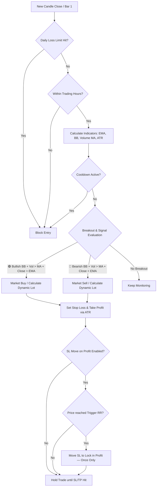
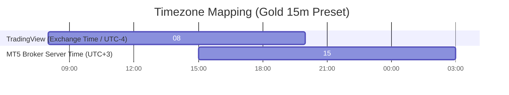

# 📈 Breakout Follow Trend 101

[](https://github.com/jzd101/breakout-follow-101)
[](https://github.com/jzd101/breakout-follow-101)
[](https://github.com/jzd101/breakout-follow-101)
[](https://github.com/jzd101/breakout-follow-101)
[](https://github.com/jzd101/breakout-follow-101)
[](https://github.com/jzd101/breakout-follow-101)

An institutional-grade, quantitative trend-following framework optimized for **Gold (XAUUSD)** on the **15m timeframe**. Captures volatility expansion via Bollinger Band breakouts, rigorously validated by multi-layer EMA trend filters and volume momentum—backed by **100% logic parity** across TradingView and MetaTrader 5.

> [!NOTE]
> **Prop Firm Verification**: This strategy has been proven to successfully pass Prop Firm evaluation challenges.

> [!IMPORTANT]
> **100% Logic Parity Guarantee**: This repository maintains absolute mathematical alignment across TradingView (Visualization) and MetaTrader 5 (Execution). Every entry, exit, indicator calculation, and risk control matches perfectly across both platforms to eliminate strategy drift.

---

## 📍 Table of Contents
- [📂 Repository Blueprint](#-repository-blueprint)
- [🚀 Quick Start Guide](#-quick-start-guide)
- [📐 Core Logic & Strategy Rules](#-core-logic--strategy-rules)
- [🔄 Dual-Platform Execution Lifecycles](#-dual-platform-execution-lifecycles)
- [🛡️ Advanced Risk Management & Capital Preservation](#-advanced-risk-management--capital-preservation)
- [🕒 Timezone Mapping & Synchronization](#-timezone-mapping--synchronization)
- [🤝 System Parity & Math Alignment](#-system-parity--math-alignment)
- [🖼️ Visual Chart Tools (TradingView)](#-visual-chart-tools-tradingview)
- [🏆 High Win-Rate Preset Parameters (15m)](#-high-win-rate-preset-parameters-15m)
- [💖 Support this Project](#-support-this-project)

---

## 📂 Repository Blueprint

```text
breakout-follow-101/
├── .agents/                 # AI Assistant skills, rules, and workspace configurations
├── img/                     # Image assets (e.g. donation QR code)
├── src/
│   ├── mql5/                # MetaTrader 5 Expert Advisor (BreakoutFollowTrend.mq5)
│   └── pine/                # TradingView Pine Script v5 (BreakoutFollowTrend_Strategy.pine)
└── README.md                # Comprehensive System Technical Specification (This File)
```

---

## 🚀 Quick Start Guide

### 1. MetaTrader 5 Expert Advisor (Automated Execution)
1. Copy [BreakoutFollowTrend.mq5](src/mql5/BreakoutFollowTrend.mq5) to your terminal's `/MQL5/Experts/` directory.
2. Open **MetaEditor** (`F4`), compile the script, and attach it to a **Gold (XAUUSD)** chart on the **15m** timeframe.
3. Enable **Algo Trading** in your MT5 terminal toolbar.

### 2. TradingView Pine Script (Visualization & Backtesting)
1. Copy the full source code from [BreakoutFollowTrend_Strategy.pine](src/pine/BreakoutFollowTrend_Strategy.pine).
2. In TradingView, open the **Pine Editor** tab, paste the code, and click **Save**.
3. Click **Add to Chart** and open the **Strategy Tester** tab to inspect trade histories and performance metrics.

---

## 📐 Core Logic & Strategy Rules

The Breakout Follow Trend system relies on pure statistics and momentum confirmation, removing emotional variables from execution.



### Technical Indicators & Settings
| Indicator | Default Setting | Purpose |
| :--- | :--- | :--- |
| **EMA** | Period = `200` | Primary Trend Filter |
| **EMA Body Overlap Filter** | `Enabled` (`true`) | Blocks entries when signal bar's High-Low range straddles the EMA (direction ambiguous) |
| **Bollinger Bands** | Period = `15`, StdDev = `1.5` | Breakout Trigger |
| **Volume MA** | Period = `15` (SMA) | Momentum Filter |
| **ATR** | Period = `18` | Dynamic SL/TP Base (Wilder's RMA Smoothing) |

---

### 🟢 LONG (Buy Entry) Conditions
All conditions must be confirmed on the **Close of Candle 1** (completed candle):
* **Trend Filter**: Price is strictly above EMA 200 (`Close > EMA 200`).
* **EMA Body Filter**: Signal bar's High-Low range must NOT straddle the EMA (`Low > EMA 200` — EMA is fully below the candle).
* **BB Breakout**: Candle close is greater than the Upper Bollinger Band (`Close > Upper BB`).
* **Volume Momentum**: Volume is greater than the 15-period Volume MA (`Volume > Vol SMA 15`).
* *Execution: Market BUY order opened at the open of the very next candle (Candle 0).*

### 🔴 SHORT (Sell Entry) Conditions
All conditions must be confirmed on the **Close of Candle 1** (completed candle):
* **Trend Filter**: Price is strictly below EMA 200 (`Close < EMA 200`).
* **EMA Body Filter**: Signal bar's High-Low range must NOT straddle the EMA (`High < EMA 200` — EMA is fully above the candle).
* **BB Breakout**: Candle close is less than the Lower Bollinger Band (`Close < Lower BB`).
* **Volume Momentum**: Volume is greater than the 15-period Volume MA (`Volume > Vol SMA 15`).
* *Execution: Market SELL order opened at the open of the very next candle (Candle 0).*

---

## 🔄 Dual-Platform Execution Lifecycles

Understanding how TradingView and MetaTrader 5 process price data is crucial for achieving 100% execution parity.

* **TradingView Historical vs. Real-Time Execution**: In TradingView, backtesting calculations run once per candle close. When a candle closes (**Bar 1**), indicators are evaluated. If a breakout occurs, Pine Script's execution engine simulates entry at the opening tick of the next bar (**Bar 0**).
* **MT5 EA Real-Time Execution**: The MT5 Expert Advisor operates within the `OnTick()` event loop. To avoid entering trades mid-candle (which creates historical divergence), the EA monitors when a new bar has just opened. Once detected, it immediately queries indicator buffers for the completed candle (**Bar 1**) to evaluate trade signals and execute instantly on **Bar 0**.

---

## 🛡️ Advanced Risk Management & Capital Preservation

The Breakout Follow Trend system incorporates active institutional-grade capital preservation safeguards, fully integrated and logically aligned across MQL5 and Pine Script.

### 1. Dynamic Volatility-Based Position Sizing
When **Compounding Risk** is enabled, trade lot size is dynamically computed based on active account equity and the volatility-based Stop Loss distance (ATR multiplied by the ATR Multiplier).
* **Compounding Enabled**: Lot sizes scale up as the account grows and shrink during drawdowns.
* **Compounding Disabled**: Sizing is calculated using a user-defined Fixed Balance (`Fixed Balance = 10,000`), maintaining consistent lot sizes regardless of live equity.
* **Tick Rounding**: Both platforms round Stop Loss and Take Profit distances to the nearest tick value before executing, preventing order rejection on MT5 due to raw decimal price offsets.

### 2. Transactional Daily Loss Limit (Drawdown Lockout)
To protect against consecutive losses or black swan events, the system features a realized **Daily Loss Limit**.
* **Realized P&L Tracker**: The system tracks realized transaction profit/loss in real-time.
* **Threshold Blocking**: Once net realized loss for the current server day exceeds the specified percentage (default: `1.0%` of starting balance), the system immediately suspends all new entries.
* **Automatic Reset**: The lockout automatically resets on the next server trading day at 00:00.

### 3. Weekend Liquidation Policy
Holding open positions over the weekend exposes accounts to high-volatility broker gaps.
* When **Weekend Close** is enabled, the system force-closes all active positions at Friday's designated cutoff time (default: `23:45`).
* New orders are blocked until Monday morning at the designated starting hour.

### 4. SL Move on Profit (Breakeven+ Protection)
An optional, per-trade mechanism to protect accumulated profit once a trade reaches a defined Risk:Reward milestone.
* **Trigger Threshold**: When price reaches `Trigger at RR × SL distance` from entry (default: `0.2 RR`), the feature activates.
* **New SL Placement**: Stop Loss is repositioned to `Entry ± (TP distance × New SL % / 100)` (default: `12%` of full TP distance locked into profit).
* **One-Shot Guard**: SL is moved only once per position—it cannot trigger twice or reverse.
* **Improvement-Only Rule**: The new SL is applied only if it is strictly better than the current SL.

### 5. Cooldown Bars After Close/SL/TP
An optional mechanism to prevent consecutive entries immediately after a position closes, giving the market time to settle before re-entering.
* **Trigger**: Activates whenever any position managed by the EA is closed—whether by SL hit, TP hit, or weekend force-close.
* **Cooldown Duration**: The system blocks new entries for **X completed bars** on the active timeframe after the close bar (default: `9 bars` = 2 hours 15 minutes on a 15m timeframe).
* **Toggle**: Can be fully enabled or disabled via the `Enable Cooldown Bars` parameter.

---

## 🕒 Timezone Mapping & Synchronization

Pine Script evaluates session timing using **Exchange Time (UTC-4 / New York Time)**, whereas MetaTrader 5 uses **Broker Server Time**.



1. **TradingView's Exchange Time**: Pine Script evaluates candle timestamps using the asset's Exchange Time (**UTC-4** for Gold/XAUUSD). For the Gold 15m Preset, the trading session runs from **08:00 to 20:00** (`Start Hour = 8`, `End Hour = 20`).
2. **Timezone Offset Conversion**: To calculate your MT5 broker's parameters from TradingView Exchange Time:
   $$\text{MT5 Hour} = \text{TradingView Exchange Hour} + (\text{MT5 Broker UTC} - (-4))$$
3. **Universal Conversion Lookup (Gold 15m Preset)**:
   To run the high-precision **Gold 15m Preset** (TradingView Exchange Time `08:00 - 20:00`), configure your MT5 EA parameters based on your broker's server timezone offset:
   * **UTC + 0** (GMT Broker): MT5 Start Hour = `12`, End Hour = `24`
   * **UTC + 2** (EET Standard / Winter): MT5 Start Hour = `14`, End Hour = `2` (Overnight)
   * **UTC + 3** (EEST / Cyprus - Standard Broker): MT5 Start Hour = `15`, End Hour = `3` (Overnight)
   * **UTC + 5** (Central Asian Broker): MT5 Start Hour = `17`, End Hour = `5` (Overnight)

---

## 🤝 System Parity & Math Alignment

To preserve system integrity, any mathematical or logic updates must be implemented across both platforms simultaneously. Parity is maintained via the following alignment techniques:

* **Tick-Size Rounding**: Both platforms round SL/TP distances using the symbol's tick size before calculating execution prices. This aligns the math and prevents MT5 order rejection.
* **Completed-Bar Hour Filtering**: Hour limits are evaluated based on the completed signal bar's open time (Bar 1) rather than the active tick time (Bar 0). This prevents a 1-bar discrepancy on session window transitions.
* **Indicator Buffer Synchronization**: In MQL5, indicators run asynchronously. When a new bar forms, the EA queries indicators using the exact datetime of the completed signal bar (`bar1_time`) rather than index-based offsets. If values are not yet updated, the EA retries on the next tick, avoiding a 1-bar delay.
* **Indicator & Volume Smoothing**: Both environments use Wilder's Smoothing (RMA) for ATR calculations and anchor SL/TP distances to the actual fill price of the entry candle rather than the signal candle's close.
* **Per-Entry SL/TP Queue**: When executing multiple concurrent positions (`MaxTrades > 1`), both platforms utilize a queue structure to map unique entry IDs to their correct ATR-based SL/TP distances, preventing visual-to-broker parameter mismatches.

---

## 🖼️ Visual Chart Tools (TradingView Only)

The Pine Script strategy renders a live, interactive position management overlay directly on the TradingView chart, mimicking TradingView's native order tools. It draws dynamic, color-coded boxes and labels anchored to the actual fill price, as well as the EMA filter line and Bollinger Bands. These elements are automatically updated with each active bar and remain on the chart as trade history after the trades are closed.

| Element | Color | Description |
| :--- | :--- | :--- |
| **TP Box** | 🟢 Green `#089981` | Take Profit zone from entry to TP price |
| **SL Box** | 🔴 Red `#f23645` | Stop Loss zone from entry to SL price |
| **SL Box (moved)** | 🟡 Amber `#d4a017` | SL box turns amber after *SL Move on Profit* is triggered, with label updated to `SL★` |
| **Entry Line** | ⬜ Gray `#b2b5be` | Dashed horizontal line at the entry fill price |

---

## 🏆 High Win-Rate Preset Parameters (15m)

For traders seeking higher accuracy and a larger Profit Factor with fewer, high-precision trades, attach the system to a **15m chart** using these optimized settings:

| Category | Parameter | Gold 15m Setting | Purpose / Description |
| :--- | :--- | :--- | :--- |
| **Risk Management** | Risk % per Trade | **1.6%** | Standard risk exposure |
| | Risk:Reward Ratio | **2.2** | 1:2.2 TP to maximize returns with high probability |
| | ATR Multiplier (SL) | **2.0** | Balanced volatility-based stop loss |
| | Max Concurrent Trades| **1** | Strictly single-trade focus |
| | Use Compounding Risk | **Disabled** (false) | Compound lot sizing based on account equity |
| | Fixed Balance | **10,000** | Reference balance when compounding is disabled |
| | Daily Loss Limit % | **1.0%** | Max realized loss threshold of base balance per day |
| **SL Move on Profit** | Enable SL Move | **Enabled** (true) | Toggle breakeven+ protection |
| | Trigger at RR | **0.2** | Move SL when price reaches RR from entry |
| | New SL at % of TP Dist | **12%** | New SL = Entry + X% of full TP range |
| **Indicators** | EMA Filter | **Enabled** (true) | Trend-following direction lock |
| | EMA Body Overlap Filter | **Enabled** (true) | Block entry when candle straddles EMA |
| | EMA Period | **200** | Long-term trend reference |
| | Bollinger Bands Period| **15** | Short-term volatility contraction range |
| | BB Deviation | **1.5** | Breakout signal threshold |
| | ATR Period | **18** | Smooth volatility range estimation over specified bars |
| **Volume Confirmation**| Volume Filter | **Enabled** (true) | Exclude low-momentum breakouts |
| | Volume MA Period | **15** | Vol SMA baseline |
| **Session Timing** | Start Hour | **8** | Trading session open (Exchange Time) |
| | End Hour | **20** | Trading session close (Exchange Time) |
| | Weekend Close | **Enabled** (true) | Let targets play out without forced close |
| | Friday Close Time | **2345** | Weekly safety exit threshold |
| **Cooldown After Close** | Enable Cooldown Bars | **Enabled** (true) | Block entries for X bars after any close/SL/TP |
| | Cooldown Bars | **9** | Number of bars to wait before re-entering |

---

## 💖 Support this Project

If this system has helped you, consider buying me a coffee! ☕

**USDC Address (ERC20):** `0x104FA6E83F2322bdFbf1501a6d9959A0a76bc1D7`

*Or simply scan the QR code below:*

<div align="center">
  <br>
  
</div>
