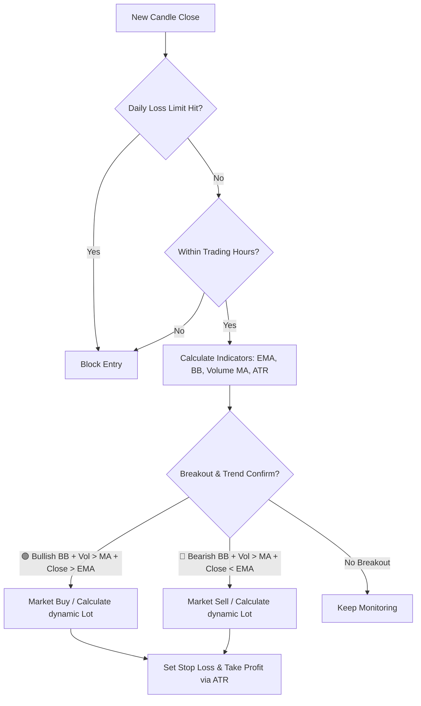

# 📈 Breakout Follow Trend 101

[](https://github.com/jzd101/breakout-follow-101)
[](https://github.com/jzd101/breakout-follow-101)
[](https://github.com/jzd101/breakout-follow-101)
[](https://github.com/jzd101/breakout-follow-101)
[](https://github.com/jzd101/breakout-follow-101)

An automated, quantitative volatility breakout trading system specifically optimized for **Gold (XAUUSD)**. This system trades volatility expansions (Bollinger Band breakouts) confirmed by trend direction filters (EMA) and volume momentum (Volume MA), utilizing 100% aligned logic across TradingView visualization and MetaTrader 5 execution.

> [!IMPORTANT]
> **100% Logic Parity Guarantee**: This repository maintains absolute mathematical alignment across TradingView (Visualization) and MetaTrader 5 (Execution). Every entry, exit, indicator, and risk calculation matches perfectly across both platforms to eliminate platform discrepancy ("strategy drift").

---

## 📂 Repository Blueprint

```text
breakout-follow-101/
├── .agents/                 # AI Assistant skills and settings
├── src/
│   ├── mql5/                # MetaTrader 5 Expert Advisor (BreakoutFollowTrend.mq5)
│   └── pine/                # TradingView Pine Script v5 (BreakoutFollowTrend_Strategy.pine)
└── README.md                # Comprehensive System Technical Specification (This File)
```

---

## 🚀 1-Minute Quick Start

### 1. MetaTrader 5 Expert Advisor
Deploy for automated real-time execution:
1. Copy [BreakoutFollowTrend.mq5](src/mql5/BreakoutFollowTrend.mq5) to your terminal's `/MQL5/Experts/` folder.
2. Compile the EA inside the MetaEditor and attach it to a **Gold (XAUUSD)** chart on the **1H** or **15m** timeframe.
3. Enable **Algo Trading** in your MT5 terminal.

### 2. TradingView Pine Script
Visualize entry signals and dynamic risk tools:
1. Copy the full source code from [BreakoutFollowTrend_Strategy.pine](src/pine/BreakoutFollowTrend_Strategy.pine).
2. In TradingView, open the **Pine Editor** tab, paste the code, and click **Save**.
3. Click **Add to Chart** and open the **Strategy Tester** tab to inspect trade histories.

---

## 📐 Core Logic & Strategy Rules

The Breakout Follow Trend system relies on pure statistics and momentum confirmation, removing emotional variables from execution.



### Technical Indicators & Settings
| Indicator | Default Setting | Purpose | Formula / Standard |
| :--- | :--- | :--- | :--- |
| **EMA** | Period = 200 | Primary Trend Filter | $\text{EMA}_t = \text{Price}_t \times \alpha + \text{EMA}_{t-1} \times (1 - \alpha)$ |
| **Bollinger Bands** | Period = 15, StdDev = 1.5 | Breakout Trigger | $\text{Basis} \pm (\text{StdDev} \times 1.5)$ |
| **Volume MA** | Period = 15 (SMA) | Momentum Filter | $\frac{1}{15}\sum_{i=1}^{15}\text{Volume}_i$ |
| **ATR** | Period = 14 | Dynamic SL/TP Base | Wilder's RMA Smoothing (Equivalent to RMA) |

---

### 🟢 LONG (Buy Entry) Conditions
All conditions must be confirmed on the **Close of Candle 1** (completed candle):
*   **Trend Filter**: Price is strictly **above** EMA 200 (`Close > EMA 200`).
*   **BB Breakout**: Candle close is **greater than** the Upper Bollinger Band (`Close > Upper BB`).
*   **Volume Momentum**: Volume is **greater than** the 15-period Volume MA (`Volume > Vol SMA 15`).
*   *Execution: Market BUY order opened at the open of the very next candle (Candle 0).*

### 🔴 SHORT (Sell Entry) Conditions
All conditions must be confirmed on the **Close of Candle 1** (completed candle):
*   **Trend Filter**: Price is strictly **below** EMA 200 (`Close < EMA 200`).
*   **BB Breakout**: Candle close is **less than** the Lower Bollinger Band (`Close < Lower BB`).
*   **Volume Momentum**: Volume is **greater than** the 15-period Volume MA (`Volume > Vol SMA 15`).
*   *Execution: Market SELL order opened at the open of the very next candle (Candle 0).*

---

## 🔄 Dual-Platform Execution Lifecycles

Understanding how TradingView and MetaTrader 5 process price data is crucial for achieving 100% execution parity.

```text
TradingView (Pine Script v5) Calculation Model:
[Bar 2 Close] ───────────► [Bar 1 Close] ───────────────► [Bar 0 Open (Active Bar)]
(Calculations Completed)   (All Entry Conditions Evaluated) (Order Sent on open of bar 0)

MetaTrader 5 (MQL5) Event Loop:
[OnTick / OnTimer] ──────► [Check if New Bar Formed] ──► [Evaluate Bar 1 Close Indicators] ──► [Execute CTrade]
(Fires on every tick)      (If new bar 0 has just opened) (Evaluates completed Bar 1 data)   (Sends instant market order)
```

1. **TradingView's Historical vs. Real-time Execution**: In TradingView, backtesting calculations run once per candle close. When a candle closes (Bar 1), the indicators are evaluated. If a breakout occurs, Pine Script's execution engine simulates the entry at the opening tick of the next bar (Bar 0).
2. **MT5 Expert Advisor Real-time Execution**: The MT5 Expert Advisor (`BreakoutFollowTrend.mq5`) operates within the `OnTick()` event loop. To avoid entering trades mid-candle (which creates massive historical divergence), the EA monitors when a new bar has just opened (`current_time != last_time`). Once detected, it immediately queries the historical buffers for the completed candle (Bar 1) to evaluate trade signals and execute instantly on Bar 0.

---

## 🛡️ Advanced Risk & Capital Preservation Controls

The Breakout Follow Trend system incorporates active institutional-grade capital preservation safeguards, fully integrated and logically aligned across MQL5 and Pine Script.

### 1. Dynamic Volatility-Based Position Sizing
When **Compounding Risk** is enabled, the trade lot size is dynamically computed based on the active account equity and the volatility-based Stop Loss distance.

$$\text{Risk Amount} = \text{Base Balance} \times \left( \frac{\text{Risk \%}}{100} \right)$$

$$\text{Stop Loss Distance} = \text{ATR (14)} \times \text{ATR Multiplier}$$

$$\text{Position Size (Lots)} = \frac{\text{Risk Amount}}{\left(\frac{\text{SL Distance}}{\text{Tick Size}}\right) \times \text{Tick Value per Lot}}$$

*   **Compounding Enabled**: `Base Balance = Live Account Equity` — lot sizes scale up as the account grows and shrink during drawdowns.
*   **Compounding Disabled**: `Base Balance = User-defined Fixed Balance (when compounding off)` — maintains fixed contract/lot sizes regardless of equity.
*   *Tick Rounding Safety*: Both platforms mathematically round the Stop Loss and Take Profit distances to the nearest tick value before executing. This prevents order rejection on MT5 due to raw decimal price offsets.

### 2. Transactional Daily Loss Limit (Drawdown Lockout)
To protect against consecutive losses or unpredictable market "black swan" events, the system features a realized **Daily Loss Limit**.

*   **Realized P&L Tracker**: The system tracks realized transaction profit/loss in real-time.
*   **Threshold Blocking**: Once the total net realized loss for the current server day exceeds the specified percentage (e.g., `2.0%` of daily starting balance), the system **immediately suspends all new entries**.
*   **Automatic Reset**: The lockout automatically resets on the next server trading day.
*   **Gregorian Calendar Rollover Protection**: To ensure continuous calendar integrity and avoid locking out during month-end boundary transitions, both systems use Gregorian calendar checks:
    *   **MQL5**: Evaluates month and year shifts (`dt.day`, `dt.mon`, `dt.year`) to prevent reset failures during monthly transitions.
    *   **Pine Script**: Tracks daily timestamp milestones (`time("D")`) for continuous calendar integrity.

### 3. Weekend Liquidation Policy
Holding open positions over the weekend exposes accounts to high-volatility broker gaps and spread expansions.
*   When `Weekend Close` is enabled, the system monitors broker server time.
*   On Friday evening at the specified cutoff time (default: `23:45`), the system **force-closes all active positions** and **blocks all new trade entries**.
*   New orders are blocked until Monday morning at the designated starting hour.
*   **Log-Flooding Mitigation (MQL5)**: The EA's Friday close timer check isolates active position queries (`CountOpenPositions() > 0`), ensuring execution logs are never flooded with redundant close requests.

---

## 🕒 Global Synchronization & Timezone Conversion Matrix

When setting up the trading session times, it is critical to understand how TradingView (Pine Script) and MetaTrader 5 (MT5) interpret time parameters to maintain **absolute parity** in execution.

```mermaid
gantt
    title Timezone Mapping (Gold 15m Preset)
    dateFormat HH
    axisFormat %H:00
    section TradingView (Exchange Time / UTC-4)
    Trading Session (13:00 - 20:00) :active, 13, 20
    section MT5 Broker Server Time (UTC+3)
    Trading Session (20:00 - 03:00) :crit, 20, 27
```



### 1. Understanding TradingView's Exchange Time
*   **Visual Clock vs. Back-end Logic**: Changing the timezone at the bottom-right corner of your TradingView screen (e.g., to UTC+7 Bangkok Time) is only a visual aid for chart viewing.
*   **Pine Script Behavior**: Under the hood, the Pine Script engine ignores your localized UI timezone. It always evaluates candle timestamps using the asset's **Exchange Time** (which is **UTC-4 / New York Time** for Gold/XAUUSD).
*   **Parameters**: Therefore, entering `Start Hour = 13` and `End Hour = 20` in the TradingView strategy strictly translates to **13:00** and **20:00 Exchange Time (UTC-4)**.

### 2. Timezone Offset Conversion Formula
To find the exact time difference between your MT5 broker's server time and TradingView's Exchange time, compare the hourly candle timestamp on both platforms at the same moment:

$$\text{Time Offset} = \text{MT5 Server Time (UTC)} - \text{TradingView Exchange Time (UTC-4)}$$

$$\text{MT5 Parameter} = (\text{TradingView Parameter} + \text{Time Offset}) \pmod{24}$$

### 3. Universal Conversion Lookup Matrix (Gold 15m Preset)
To run the high-precision **Gold 15m Preset** (TradingView: 13:00 - 20:00 Exchange Time), configure your MT5 EA parameters based on your broker's server timezone offset:

| Broker MT5 Timezone (Standard) | Time Offset | MT5 Start Hour Input | MT5 End Hour Input |
| :--- | :--- | :--- | :--- |
| **UTC + 0** (e.g., GMT Broker) | $+4 \text{ Hours}$ | `17` | `0` (Midnight) |
| **UTC + 2** (e.g., Eastern European Standard Time) | $+6 \text{ Hours}$ | `19` | `2` (Overnight) |
| **UTC + 3** (e.g., Eastern European Daylight Time / Cyprus) | **$+7 \text{ Hours}$ (Standard)** | **`20`** | **`3` (Overnight)** |
| **UTC + 5** (e.g., Central Asian Broker) | $+9 \text{ Hours}$ | `22` | `5` (Overnight) |

---

## 🤝 System Parity & Math Alignment

To preserve system integrity, any mathematical or logic update **MUST** be implemented across both platforms simultaneously. Below is the technical breakdown of how absolute parity is achieved between **TradingView (Pine Script v5)** and **MetaTrader 5 (MQL5)**:

### 1. Stop Loss & Take Profit Tick-Size Rounding

TradingView calculates SL/TP exits in ticks, which inherently rounds the distances to the nearest tick before establishing execution levels. MT5 broker terminals will reject or slightly shift orders if SL/TP are submitted as raw floating-point decimals. Both platforms round distances using the symbol's tick size before calculating final prices:

```pinescript
// TradingView (Pine Script v5) — round distance, then multiply back to price units
float sd_rounded = math.round(sd / syminfo.mintick) * syminfo.mintick
float tp_rounded = math.round((sd * inpRR) / syminfo.mintick) * syminfo.mintick

float sl = is_long ? entry_price - sd_rounded : entry_price + sd_rounded
float tp = is_long ? entry_price + tp_rounded : entry_price - tp_rounded
```

```mql5
// MetaTrader 5 (MQL5)
double tickSize = SymbolInfoDouble(_Symbol, SYMBOL_TRADE_TICK_SIZE);
if(tickSize <= 0) tickSize = _Point;

double slDist_rounded = MathRound(slDist / tickSize) * tickSize;
double tpDist_rounded = MathRound((slDist * InpRR) / tickSize) * tickSize;

double slPrice = NormalizeDouble(entryPrice - slDist_rounded, _Digits); // Long
double tpPrice = NormalizeDouble(entryPrice + tpDist_rounded, _Digits); // Long
```

### 2. Completed-Bar Hour Filtering

Pine Script evaluates conditions on the close of a candle (Signal Bar at index 1) and executes orders at the open of the next candle (Entry Bar at index 0). Evaluating the active tick's hour in MT5 causes a 1-bar discrepancy on session window transitions (e.g. entry occurs 1 bar late). We align the session timing by evaluating the completed signal bar's open time instead of active tick time:

```pinescript
// TradingView (Pine Script v5)
// 'hour' represents the hour of the signal bar being evaluated
isInTimeWindow = inpStartHour < inpEndHour ? (hour >= inpStartHour and hour < inpEndHour) : (hour >= inpStartHour or hour < inpEndHour)
```

```mql5
// MetaTrader 5 (MQL5)
// Query completed bar (index 1) time
datetime bar1_time = iTime(_Symbol, _Period, 1);
MqlDateTime dt_time;
TimeToStruct(bar1_time, dt_time);

bool in_time_window = true;
if(InpStartHour < InpEndHour)
   in_time_window = (dt_time.hour >= InpStartHour && dt_time.hour < InpEndHour);
else
   in_time_window = (dt_time.hour >= InpStartHour || dt_time.hour < InpEndHour);
```

### 3. Indicator & Volume Smoothing

*   **RMA Smoothing**: Always calculate ATR using Wilder's Smoothing (RMA) to ensure SL/TP calculations match Pine and MQ5.
*   **Fill-Price Anchoring**: SL and TP distances are anchored strictly to the **actual fill price** (`strategy.opentrades.entry_price`) of the execution candle, preventing calculation drift from using signal-bar close price.
*   **Volume Filter Parity**: Volume filters are designed to pass automatically if the volume data is unavailable or zero (`na(volMA) or volMA == 0`), preventing system lockouts on illiquid candles.
*   **Tick-Value Position Sizing**: Both platforms compute lot size via `riskAmount / (slDist / tickSize * tickValuePerLot)`. Pine Script uses `syminfo.pointvalue` for CFD/Futures scaling; MQL5 uses `SYMBOL_TRADE_TICK_VALUE` and `SYMBOL_TRADE_TICK_SIZE` for exact broker-side precision.

### 4. Per-Entry SL/TP Queue (MaxTrades > 1 Support)

When `MaxTrades > 1`, multiple signals can fire on consecutive bars before the visual engine processes them. To prevent an off-by-one mismatch (where the wrong ATR value is used for a visual tool), each signal's `slDist` is pushed into a keyed queue (`sl_entry_ids` / `sl_dist_queue`) *before* the entry is submitted. When the entry is confirmed, the queue is looked up by the unique entry ID (e.g., `"L5"` → `5`) and the correct distance is retrieved and removed.

---

## 🖼️ Visual Chart Tools (TradingView Only)

The Pine Script strategy renders a live **position management overlay** directly on the TradingView chart — matching the visual experience of TradingView's built-in order tools. This is a display-only layer; it has no effect on backtest calculations.

| Visual Element | Description |
| :--- | :--- |
| **EMA Line** | Blue line showing the EMA Trend Filter (hidden when EMA Filter is disabled) |
| **Bollinger Bands** | Upper and Lower BB with a semi-transparent grey fill zone |
| **TP Box** (green) | A dynamically extended green box from entry to Take Profit price |
| **SL Box** (red) | A dynamically extended red box from entry to Stop Loss price |
| **Entry Line** (grey dashed) | A dashed horizontal line marking the exact fill price of each open trade |
| **TP Label** (green) | Right-edge label showing TP price and distance in pips/ticks |
| **SL Label** (red) | Right-edge label showing SL price and distance in pips/ticks |
| **Entry Label** (grey) | Right-edge label showing trade direction (▲ LONG / ▼ SHORT) and fill price |

### Visual Lifecycle
1. **On New Entry**: A TP box, SL box, entry dashed line, and three labels (TP, SL, Entry) are created anchored at the actual fill price (`strategy.opentrades.entry_price`), using the signal bar's ATR-based SL/TP distances rounded to the nearest tick.
2. **Per Bar**: All active boxes, lines, and labels extend to the current bar automatically.
3. **On Trade Close**: The closed trade's boxes, line, and labels are deleted to keep the chart clean.
4. **Emergency Reset**: If `strategy.position_size == 0` but stale visual objects remain (e.g. after a manual strategy restart), all objects are force-deleted and arrays are cleared.

### Pip / Tick Display
The label helper `f_pips()` converts the raw tick distance into human-readable pips:
*   **Forex (5-decimal pairs)**: divides tick count by 10 to display standard pips.
*   **All other instruments** (e.g., Gold/CFDs): displays the raw tick count directly.

---

## 🏆 High Win-Rate & Precision Settings (Gold 15m Preset)

For traders seeking **higher accuracy (Win Rate)** and a **larger Profit Factor** with **fewer, high-precision trades**, attach the system to a **15m chart** using these optimized settings:

| Category | Parameter | Gold 15m Setting | Default (1H) | Purpose / Description |
| :--- | :--- | :--- | :--- | :--- |
| **Risk Management** | Risk % per Trade | **1.0%** | 2.0% | Halved risk exposure to reduce drawdowns |
| | Risk:Reward Ratio | **1.0** | 2.0 | 1:1 TP to maximize high-probability fills |
| | ATR Multiplier (SL) | **1.5** | 2.0 | Tighter dynamic stop loss |
| | Max Concurrent Trades| **1** | 1 | Strictly single-trade focus |
| **Indicators** | EMA Filter | **Enabled** (true) | Enabled | Trend-following direction lock |
| | EMA Period | **200** | 200 | Long-term trend reference |
| | Bollinger Bands Period| **15** | 15 | Short-term volatility contraction range |
| | BB Deviation | **1.5** | 1.5 | Breakout signal threshold |
| **Volume Confirmation**| Volume Filter | **Enabled** (true) | Enabled | Exclude low-momentum breakouts |
| | Volume MA Period | **15** | 15 | Vol SMA baseline |
| **Session Timing** | Start Hour | **13** | 7 | **Shifted to 13:00** (Golden time window to achieve the highest Profit Factor) |
| | End Hour | **20** | 20 | Closes window at 20:00 (Golden time window to achieve the highest Profit Factor) |
| | Weekend Close | **Disabled** (false) | Disabled | Let targets play out without forced close |
| | Friday Close Time | **2345** | None | Weekly safety exit threshold |

---

## ⚙️ Master Parameter & Configuration Reference

### 1. MetaTrader 5 Expert Advisor (`BreakoutFollowTrend.mq5`)
| Input Name | Default | Type | Description |
| :--- | :--- | :--- | :--- |
| `InpRiskPct` | `2.0` | `double` | Risk % per trade based on SL distance |
| `InpRR` | `2.0` | `double` | Risk Reward Ratio (Multiplier for Take Profit) |
| `InpATRMult` | `2.0` | `double` | ATR Multiplier for dynamic Stop Loss distance |
| `InpCompound` | `true` | `bool` | Enable Compounding Risk based on current equity |
| `InpFixedBalance`| `10000.0`| `double` | Fixed balance if Compounding is false |
| `InpUseEMA` | `true` | `bool` | Filter entries using 200 EMA trend line |
| `InpUseVol` | `true` | `bool` | Filter entries using Volume MA filter |
| `InpEMAPeriod` | `200` | `int` | EMA Trend Filter Period |
| `InpBBPeriod` | `15` | `int` | Bollinger Bands Period |
| `InpBBDev` | `1.5` | `double` | Bollinger Bands Standard Deviation |
| `InpATRPeriod` | `14` | `int` | ATR Smoothing Period |
| `InpVolPeriod` | `15` | `int` | Volume MA Period |
| `InpMagic` | `123456` | `int` | Unique Magic Number for position tracking |
| `InpWeekendClose` | `false` | `bool` | Enable Friday evening close safety exit |
| `InpFridayTime` | `"2345"` | `string` | Friday Time to close (Broker Time, e.g. `23:45` or `2345`) |
| `InpMaxTrades` | `1` | `int` | Maximum concurrent trades |
| `InpDailyLossLimit`| `2.0` | `double` | Realized daily drawdown lockout percentage (0 = disabled) |
| `InpStartHour` | `7` | `int` | Trading window start hour (Broker Server Time) |
| `InpEndHour` | `20` | `int` | Trading window end hour (Broker Server Time) |

### 2. TradingView Pine Script (`BreakoutFollowTrend_Strategy.pine`)
| Internal Variable | UI Display Label | Default | Type | Description |
| :--- | :--- | :--- | :--- | :--- |
| `inpRiskPct` | `Risk % per Trade` | `2.0` | `float` | Percentage of base balance to risk based on SL distance |
| `inpRR` | `Risk:Reward Ratio` | `2.0` | `float` | Target Risk to Reward multiple |
| `inpATRMult` | `ATR Multiplier (SL)` | `2.0` | `float` | ATR multiplier to determine Stop Loss distance |
| `inpMaxTrades` | `Max Concurrent Trades` | `1` | `int` | Maximum concurrent open positions |
| `inpCompound` | `Use Compounding Risk` | `true` | `bool` | Use Compounding Risk based on current equity |
| `inpFixedBal` | `Fixed Balance (when compounding off)`| `10000.0` | `float` | Fixed balance if Compounding is disabled |
| `inpDailyLoss` | `Daily Loss Limit %` | `2.0` | `float` | Realized daily loss lockout percentage (0 = disabled) |
| `inpUseEMA` | `Use EMA Trend Filter` | `true` | `bool` | Filter entries using EMA trend filter |
| `inpEMAPeriod` | `EMA Period` | `200` | `int` | EMA Trend Filter Period |
| `inpBBPeriod` | `Bollinger Bands Period`| `15` | `int` | Bollinger Bands Period |
| `inpBBDev` | `Bollinger Bands Deviation`| `1.5` | `float` | Bollinger Bands Standard Deviation |
| `inpATRPeriod` | `ATR Period` | `14` | `int` | ATR Period for Stop Loss calculation |
| `inpUseVol` | `Use Volume Filter` | `true` | `bool` | Enable Volume filter momentum filter |
| `inpVolPeriod` | `Volume MA Period` | `15` | `int` | Volume MA Period |
| `inpStartHour` | `Start Hour (0-23)` | `7` | `int` | Strategy trading window start hour (Exchange Time) |
| `inpEndHour` | `End Hour (0-23)` | `20` | `int` | Strategy trading window end hour (Exchange Time) |
| `inpWeekendCl` | `Weekend Close (Friday)`| `false` | `bool` | Enable Friday evening close safety exit |
| `inpFridayTime` | `Friday Close Time (HHMM)`| `"2345"` | `string` | Friday Time to close in HHMM format |

---

## 🛡️ Production Deployment & VPS Checklist

Deploying a quantitative trading system requires strict compliance with trade environment constraints. Follow this checklist before launching on a live production environment:

1. **Hedging Account Mode Required**: 
   * **Mandatory**: Your MT5 trading account must support **Hedging** (allowing multiple concurrent or opposing positions). Netting accounts will cause position aggregation, corrupting the EA's trade tracking.
2. **Virtual Private Server (VPS)**:
   * **Setup**: Deploy the MT5 terminal to a low-latency VPS physically located near your broker's execution server (London/LD4 or New York/NY4 are standard for Gold brokers).
   * **Uptime**: Ensure the VPS is configured with automated OS update delays and auto-start scripts for the MT5 terminal to prevent downtime during active hours.
3. **Indicator Pre-calculation**:
   * **Execution**: Upon first attachment, the MQL5 indicator handles `iMA` and `iBands` initialize instantly, but history stabilization is required for the RMA ATR. The EA stabilizes the ATR by seeding with a large history window (`period * 50` bars) to converge to the correct value before executing any trades.
4. **Broker-Specific Spread & Commission Guard**:
   * Gold spreads can expand drastically during high-impact news releases or rollover hours (23:59 - 00:05 Server Time). Ensure your broker offers institutional raw-spread accounts for Gold to minimize slippage, as high transaction costs can significantly erode breakout performance.
5. **Magic Number Isolation**:
   * Assign a unique magic number (`InpMagic`) to each chart instance if running multiple timeframes or assets. This prevents EAs from interfering with or closing each other's open positions.
